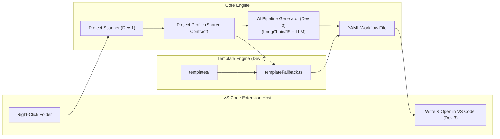

# Embedded CI/CD Pipeline Architect — Implementation Plan & Team Division

A VS Code extension that lets embedded developers right-click a project folder and generate a production-ready CI/CD pipeline (GitHub Actions or GitLab CI) tailored to their MCU project.

---

## 👥 Simultaneous Team Division (3 Developers)

To work on this project simultaneously and avoid code conflicts, we have modularized the project architecture using the **Strategy**, **Provider**, and **Liskov Substitution** design principles. 

Here is how you and your two friends can divide the project:

### 🧑‍💻 Developer 1: The Scanner Architect (Detection Layer)
*   **Focus**: Project parsing, AST analysis, folder structures, and configuration scraping.
*   **Ownership Files**:
    *   `src/core/scanner/types.ts`
    *   `src/core/scanner/scannerRegistry.ts`
    *   `src/core/scanner/platformioScanner.ts`
    *   `src/core/scanner/cmakeScanner.ts`
    *   `src/core/scanner/arduinoScanner.ts`
    *   `src/core/scanner/espIdfScanner.ts`
*   **Key Tasks**:
    1.  Define the universal `ProjectProfile` contract (MCU target, environments, platforms, libraries).
    2.  Build the priority-based `ScannerRegistry` to cycle through scanners.
    3.  Implement individual scanners (PlatformIO, ESP-IDF, CMake, Arduino) to output exact data about the code.
*   **Why this works in parallel**: As long as the `ProjectProfile` interface in `types.ts` is agreed upon on Day 1, Developer 1 can write scanners offline and test them using simple mock folder structures without needing the UI or the generator layers.

---

### 🧑‍💻 Developer 2: The Workflow Designer (CI/CD Templates & Generators)
*   **Focus**: CI/CD best practices, YAML optimization, compilation environment setups, caching, and template compilation.
*   **Ownership Files**:
    *   `src/core/generator/types.ts`
    *   `src/core/generator/generatorFactory.ts`
    *   `src/core/generator/githubActionsGen.ts`
    *   `src/core/generator/gitlabCiGen.ts`
    *   `src/core/ai/templateFallback.ts`
    *   `templates/github/**/*.yml`
    *   `templates/gitlab/**/*.yml`
*   **Key Tasks**:
    1.  Design static templates for all project types (PlatformIO matrix builds, CMake-STM32, ESP-IDF).
    2.  Add advanced CI mechanisms (aggressive pip/toolchain caching, flash binary size measurement, artifact uploads).
    3.  Implement the fallback template engine (`templateFallback.ts`) to substitute double-curly-brace variables (like `{{board}}`) with data from `ProjectProfile`.
*   **Why this works in parallel**: Developer 2 only needs the `ProjectProfile` structure as an input. They can build the static templates, verify the YAML structures, and write the parser entirely in isolation from the VS Code environment or LangChain.

---

### 🧑‍💻 Developer 3: The Integration & AI Engineer (VS Code UI & LLM Orchestration)
*   **Focus**: VS Code API integration, prompt engineering, and LLM/LangChain configuration.
*   **Ownership Files**:
    *   `src/extension.ts`
    *   `src/commands/generatePipeline.ts`
    *   `src/ui/quickPick.ts`
    *   `src/core/ai/prompts.ts`
    *   `src/core/ai/aiOrchestrator.ts`
*   **Key Tasks**:
    1.  Develop the interactive VS Code menus (QuickPicks, folder selections, and progress spinners).
    2.  Coordinate the entire program flow (URI trigger -> scanner -> selection -> generator -> file output).
    3.  Implement `aiOrchestrator.ts` using LangChain to format prompts and stream response from OpenAI/Ollama, cleaning output from markdown fences.
*   **Why this works in parallel**: Developer 3 manages the entry point and the orchestrator. By stubbing (mocking) the scanner registry and generator with dummy hardcoded profiles/YAMLs early on, Developer 3 can finalize the extension's user experience and AI prompting while Developers 1 and 2 finish the actual logic.

---

## 📐 Architecture Overview



### Design Principles (Scalability)

1.  **Separation of Concerns** — The extension UI layer is thin; all logic lives in a standalone `core/` engine that can be reused by a CLI tool, web app, or other IDE later.
2.  **Strategy Pattern for Scanners** — Each project type is a pluggable scanner. Adding a new one means adding a single file — zero changes to existing code.
3.  **Template + AI Hybrid** — Static YAML templates handle the deterministic parts (caching, checkout, artifact upload). The LLM fills in project-specific logic (env names, build commands, test commands). This keeps output reliable while still being "smart."
4.  **Provider Pattern for CI Targets** — GitHub Actions and GitLab CI are separate "providers." Adding Bitbucket Pipelines, Azure DevOps, etc. later is one new file.

---

## 🛠️ Project Structure

```
embedded-cicd-architect/
├── .vscode/                          # Dev workspace config
│   ├── launch.json                   # F5 debugging
│   └── tasks.json                    # Build tasks
├── src/
│   ├── extension.ts                  # VS Code entry point (activate/deactivate)
│   ├── commands/
│   │   └── generatePipeline.ts       # Command handler for right-click action
│   ├── ui/
│   │   └── quickPick.ts              # QuickPick UI for CI provider selection
│   ├── core/                         # ★ Standalone engine (no VS Code deps)
│   │   ├── scanner/
│   │   │   ├── types.ts              # Scanner interfaces & ProjectProfile type
│   │   │   ├── scannerRegistry.ts    # Registry that auto-discovers scanners
│   │   │   ├── platformioScanner.ts  # Detects platformio.ini projects
│   │   │   ├── cmakeScanner.ts       # Detects CMakeLists.txt projects
│   │   │   ├── arduinoScanner.ts     # Detects .ino / Arduino projects
│   │   │   └── espIdfScanner.ts      # Detects ESP-IDF (sdkconfig) projects
│   │   ├── generator/
│   │   │   ├── types.ts              # Generator interfaces
│   │   │   ├── generatorFactory.ts   # Factory for CI provider generators
│   │   │   ├── githubActionsGen.ts   # GitHub Actions YAML generator
│   │   │   └── gitlabCiGen.ts        # GitLab CI YAML generator
│   │   ├── ai/
│   │   │   ├── types.ts              # AI provider interfaces
│   │   │   ├── aiOrchestrator.ts     # LangChain agent orchestrator
│   │   │   ├── prompts.ts            # System prompts & prompt templates
│   │   │   └── templateFallback.ts   # Pure-template mode (no LLM needed)
│   │   └── index.ts                  # Public API barrel export
│   └── test/
│       ├── suite/
│       │   ├── scanner.test.ts       # Scanner unit tests
│       │   └── generator.test.ts     # Generator unit tests
│       └── runTest.ts                # VS Code test runner
├── templates/                        # Static YAML snippets
│   ├── github/
│   │   ├── platformio.yml            # GitHub Actions template for PIO
│   │   ├── cmake-stm32.yml           # GitHub Actions template for CMake STM32
│   │   └── cmake-esp-idf.yml         # GitHub Actions template for ESP-IDF/CMake
│   └── gitlab/
│       ├── platformio.yml            # GitLab CI template for PIO
│       ├── cmake-stm32.yml           # GitLab CI template for CMake STM32
│       └── cmake-esp-idf.yml         # GitLab CI template for ESP-IDF/CMake
├── package.json                      # Extension manifest
├── tsconfig.json                     # TypeScript config
├── .vscodeignore                     # Files to exclude from VSIX
├── esbuild.js                        # Bundler config
├── README.md                         # User-facing docs
├── CONTRIBUTING.md                   # How to add scanners/generators
└── ARCHITECTURE.md                   # Deep-dive into how the code works
```

---

## 🏃‍♂️ Verification Plan

### Automated Tests
```bash
# Compile the extension
npm run compile

# Run unit tests for scanners (mock file system)
npm test

# Package the extension
npx vsce package
```

### Manual Verification
1.  Press **F5** in VS Code to launch Extension Development Host.
2.  Open a sample PlatformIO project folder.
3.  Right-click the folder → "Generate CI/CD Pipeline".
4.  Select "GitHub Actions" from QuickPick.
5.  Verify `.github/workflows/embedded-ci.yml` is created with correct content.
6.  Repeat with a CMake-based STM32 project and GitLab CI selection.
